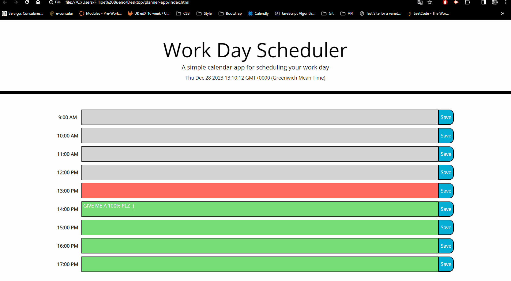

# Planner-App.

## This Project aim to show and practice using API's and the use of JavaScript properties.

This project was carried out using HTML, CSS, Bootstrap and an external API, the main goal of the project was to code using as few lines of code as possible, using functions parameters and arguments. All buttons are 100% fuctional.

### Website Interface Image:

